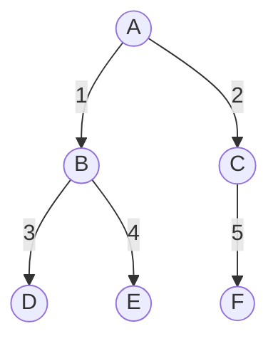
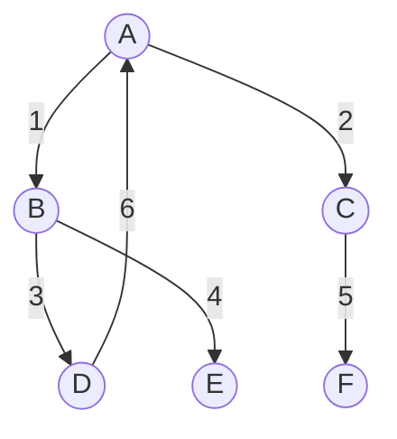

# Postgrepostgresql, recurive and graph

Soit une base de données avec une table `node` et une table `edge`:

```postgresql
    CREATE TABLE node (
        id SERIAL PRIMARY KEY,
        name VARCHAR(255) NOT NULL
    );
    
    CREATE TABLE edge (
        id SERIAL PRIMARY KEY,
        parent_id INTEGER NOT NULL REFERENCES node(id),
        child_id INTEGER NOT NULL REFERENCES node(id)
    );
```

On peut créer un arbre avec des noeuds et des arêtes:
```postgresql
INSERT INTO node (name) VALUES ('A');
INSERT INTO node (name) VALUES ('B');
INSERT INTO node (name) VALUES ('C');
INSERT INTO node (name) VALUES ('D');
INSERT INTO node (name) VALUES ('E');
INSERT INTO node (name) VALUES ('F');

INSERT INTO edge (parent_id, child_id) VALUES (1, 2); -- A -> B
INSERT INTO edge (parent_id, child_id) VALUES (1, 3); -- A -> C
INSERT INTO edge (parent_id, child_id) VALUES (2, 4); -- B -> D
INSERT INTO edge (parent_id, child_id) VALUES (2, 5); -- B -> E
INSERT INTO edge (parent_id, child_id) VALUES (3, 6); -- C -> F
```

Voici un abre avec 6 noeuds et 5 arêtes:
( un arbre est un graphe acyclique orienté )



A partir d'un cet arbre, on peut créer une vue récursive pour récupérer tous les noeuds enfants ou parent d'un noeud donné:

```postgresql
CREATE OR REPLACE VIEW node_tree AS
WITH RECURSIVE node_tree AS (
    SELECT id, name, id AS parent_id, 0 AS level
    FROM node
    UNION ALL
    SELECT node.id, node.name, edge.parent_id, node_tree.level + 1
    FROM node_tree
    JOIN edge ON edge.child_id = node_tree.id
    JOIN node ON node.id = edge.child_id
)
SELECT * FROM node_tree;
```


Maintenant transformons cet arbre en graphe orienté, en ajoutant simplement une relation cyclique entre les noeuds:

```postgresql
INSERT INTO edge (parent_id, child_id) VALUES (4, 1); -- D -> A
```
    


Dès lors, s'il y a un cycle dans le graphe, la vue `node_tree` ne fonctionnera plus, car elle est récursive et ne peut pas gérer les cycles.

Dans ce cas, on peut mémoïser les noeuds déjà visités, et ne pas les visiter une deuxième fois:

```postgresql
CREATE OR REPLACE VIEW node_tree AS
WITH RECURSIVE node_tree AS (
    SELECT id, name, id AS parent_id, 0 AS level, path
    FROM node
    UNION ALL
    SELECT node.id, node.name, edge.parent_id, node_tree.level + 1, node_tree.path || node.id
    FROM node_tree
    JOIN edge ON edge.child_id = node_tree.id
    JOIN node ON node.id = edge.child_id
    WHERE node.id NOT IN (SELECT id FROM node_tree)
)
SELECT * FROM node_tree;
```